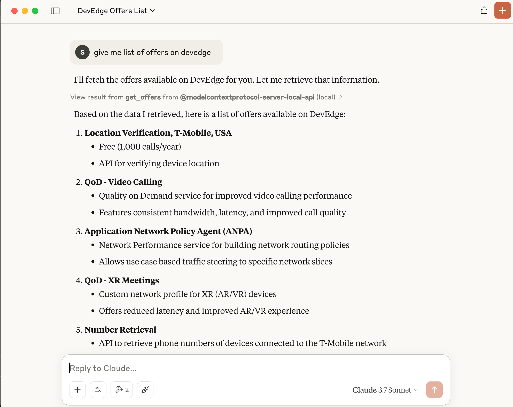

# MCP_TO_PC_ENTITIES

A MCP (Machine Communication Protocol) project that enables querying DNO APIs to fetch catalog entities and pricing rules.

## Features

- Fetch offers, products, and services from different operators
- Retrieve pricing rules from different operators

## Setup

1. Clone the repository
2. Install dependencies:
   ```bash
   pip install -r requirements.txt
   ```
3. Create a `.env` file with the following variables:
   ```
   DNO_HOST=your_dno_host
   DNO_TOKEN_KEY_ID=your_key_id
   DNO_TOKEN_KEY=your_secret_key
   ```
4. Configure in Claude Desktop:
   Add the following to your Claude Desktop configuration:
   ```json
   {
     "mcpServers": {
       "@modelcontextprotocol-server-local-api": {
         "command": "/path/to/uv",
         "args": [
           "--directory",
           "/path/to/project",
           "run",
           "dno_api.py"
         ]
       }
     }
   }
   ```
   Note: Replace `/path/to/uv` and `/path/to/project` with your actual paths

## Usage

The project provides several functions to interact with the DNO API:

- `get_offers(operator_name, entity_type)`: Fetch catalog entities (offers/products/services)
- `get_pricing_rules(operator_name)`: Fetch pricing rules

The server runs using FastMCP for communication.

## Claude Chat Interaction

Once configured in Claude Desktop, you can interact with the DNO API through Claude chat using natural language. Here are some example interactions:

- "Get all offers for operator X"
- "Fetch pricing rules for operator Y"
- "Show me the products available for operator Z"

Claude will automatically use the appropriate API endpoints and handle the authentication for you.



## Requirements

- Python 3.x
- Dependencies listed in `requirements.txt`
- Valid DNO API credentials

## License

See the [LICENSE](LICENSE) file for details.
